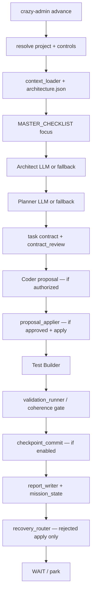

# Crazy Factory 2.0 — Independent Repository Assessment

Generated: 2026-09-16
Branch: `cursor/cf2-product-convergence-kernel-3f2d`
Baseline: 519 unit tests on `main` (`d8b51d0`). Two pre-existing
failures in lint autofix tests when `ruff` is not on `PATH`
(`skill_library.autofix_lint` degrades to no-op; subprocess looks up
the bare `ruff` binary).

This document is the audit the restart asked for. It was written by
tracing `scripts/factory_advance.py` and the modules it actually calls,
not by treating phase packages as truth.

**Priority correction (same day):** the immediate product failure is
not missing UI, dashboards, or a multi-agent organization. It is that
Crazy Factory cannot take a bounded context and **autonomously keep
working until a runnable, validated application**. The execution-path
audit, restriction classification, and P0/P1…P5 plan live in
[P0_AUTONOMOUS_LOOP.md](P0_AUTONOMOUS_LOOP.md). This file remains the
repository map; it is **not** the development priority.

---

## 1. Executive diagnosis

Crazy Factory is not an empty prototype. It is a **real, governed
task-execution kernel** that never became a **closed prompt → working
output engine**.

What exists today can:

- register a project and isolate it in a workbench;
- ingest context;
- call local models (Ollama) for Architect / Planner / Coder / Test
  Builder / reviewers;
- produce structured task contracts, proposals, and patch plans;
- apply patches inside `app/` / `src/` / `docs/` / `tests/` under
  owner switches;
- validate with an allow-listed runner;
- recover, adjudicate, and park;
- persist run state and reports across process death.

What it cannot do — the question this audit must answer — is:

> Why can't Crazy Factory behave like an autonomous
> prompt-to-working-output engine today?

The factory has many phases. Until P0, it lacked the **arrows that
return those phases to useful work**. `advance` and `mission_loop` are
one beat, then the process exits. Defaults skip apply and validation.
The owner (or `tests/autopilot_taskboard.sh`) is the continuation
controller. Observed live runs (task-board autopilot, Issue #38)
produced empty or stubbed applications while every internal ritual
completed.

That is not first a model-quality problem, and it is not first a
missing Director/MCP/UI problem. It is a missing **closed control
loop**. Product intelligence remains useful later (P2/P5). MCP should
wrap the engine (P3), not replace it.

**Keep the kernel. Stop growing phases. Close the loop. Do not build
an autonomous software company before one agentic path can complete a
small application.**

---

## 2. Current-state architecture

### What the repository actually is

Two layers that documentation still pretends are one:

| Layer | Location | Reality |
| --- | --- | --- |
| Operating context (docs-as-policy) | `factory/` | Mission, contract, roles, governance, templates. Partially stale relative to runtime. |
| Execution kernel | `scripts/`, `bin/`, `config/`, `tests/` | ~19k lines of Python. This is the real system. |
| Workbenches | `apps/<id>/` or external `apps_base` | Runtime only (gitignored). Product + factory memory live here. |

There is **no MCP server**. MCP appears only as a roadmap sentence.
There is **no Factory Director**. There is **no product model**, no
module maturity graph, no independent product/UX auditor, no
reconciliation of external git changes as a first-class operation,
and no running-product inspection (browser, CLI journey, screenshot).

Ollama is the only model adapter. Claude / Cursor / Codex are named
in docs and never invoked.

### Runtime entry points

```text
bin/crazy-admin          → scripts/crazy_admin.py   (owner CLI)
bin/factory-advance      → scripts/factory_advance.py
bin/factory-status
bin/factory-report
bin/factory-watch        → scripts/watcher.py
scripts/mission_loop.py  → one cron-safe beat (lock + flags + stall)
scripts/context_growth.py → seed grow/promote (partially orphaned)
```

There is no HTTP API, no MCP stdio server, no plugin loader.

### Actual advance (one beat)

Documented lifecycle:

```text
BOOT → READ MEMORY/STATE → ARCHITECT_EXPAND → PLAN → IMPLEMENT →
TEST → REVIEW → COMMIT → REPORT → UPDATE_MEMORY → SELECT_NEXT_TASK → WAIT
```

**Implemented lifecycle** (`factory_advance.main`):

```text
resolve project
honor stop/pause
park if self_rejection | remediation_exhausted
load context bundle + architecture.json
decompose MASTER_CHECKLIST.md if empty
expand per-file requirement spec (best-effort)
Architect → TASK_EXPANSION.md
optionally derive architecture.json from seed (opt-in, default OFF)
Planner → NEXT_ACTION.md
contract_stage → planned_task.json (authorized: false)
optional autonomy: auto-authorize
optional remediation: re-engage coder
DiagnosisPacket (situational facts)
Coder → coder_proposal.json   [skipped unless authorized+valid]
optional auto-approve (autonomy / remediation)
Apply → patch_plan.json       [preview unless approved+apply enabled]
Test Builder → test_plan.json
Validation (coherence commands if architecture.json exists)
  skipped entirely when apply was rejected this beat
Checkpoint commit            [off unless enable-commit]
persist state
maybe retire checklist item (acceptance evidence, not mere green)
no-progress monitor (5 empty beats → park)
write reports
recovery_router              [only if application_rejected AND
                              allow_remediation]
```

The documented `REVIEW` worker does **not** run as an independent
phase. "Reviewer" in runtime means: contract review, completeness
review (pre-apply, owner-gated), and adjudicator (recovery). Reporter
does not update `factory/context/PROJECT_MEMORY.md`; it writes
workbench reports.



### Project / workbench structure

Per `docs/USAGE.md` (this part matches the code):

```text
<app_path>/
  crazy_project.yaml          owner control switches
  config/factory.yaml         project-local capability template
  docs/seed.md
  app/ or src/                product code (coder write target)
  tests/
  context/                    imported knowledge (Phase 9A)
  factory_context/            PROJECT_GOAL.md + grown context
  factory_tasks/              contracts, proposals, checklist
  factory_reports/
  factory_state/              seed-grown memory, checkpoints
  state/                      factory_state.json, active_run.json,
                              project_state.json, flags, lock
  architecture.json           optional coherence contract
```

Registry: `config/projects.yaml` is an id→path directory. No global
active project. Targeting is by id, `--path`, or cwd.

### Context loading

- `context_manager.add_context` copies files/archives into
  `context/imports/` + catalog, skipping secret-like names.
- `context_loader.load_context_bundle` concatenates supported catalog
  files into the planning prompt (bounded by `max_lines_per_file`).
- Seed-grown context (`context_growth.py`) exists but is not the
  default path; `PROJECT_GOAL.md` is often still scaffold placeholder
  (task-board analysis, Issue #33).
- Per-file `requirement_expander` freezes a behavior spec once.

Context is **prompt fuel**, not a living product model. Nothing
compares intended product vs observable product after a beat except
checklist ticks and `acceptance_check`.

### Worker invocation and models

`prompt_builder.py` loads `factory/instructions/*_RULES.md` plus
`APP_BUILD_CONSTRAINTS`. `ollama_client.py` talks to
`http://localhost:11434`. `llm_interaction.structured_call` primes,
classifies refusals, and retries JSON. If Ollama is down, every role
has a **deterministic fallback** so the beat still writes planning
artifacts. That is why tests pass without a model: they are mostly
fallback/gate tests, not product-build tests.

`config/models.yaml`: worker roles share `qwen2.5-coder:14b`;
reviewer/adjudicator is `gemma4:latest`. No provider abstraction.

### Contracts

Several overlapping contract objects:

| Artifact | Module | Role |
| --- | --- | --- |
| `planned_task.json` | `task_contract.py` | Bounded coding task |
| `architecture.json` | `architecture.py` | Path/import floor + required files |
| `ProjectContract` | `project_contract.py` | Seed-derived goal/behaviors/tech |
| `FocusRequirementSpec` | `requirement_expander.py` | Per-file behaviors |
| patch plan / proposal | `coder_proposal.py`, `proposal_applier.py` | Implementation |
| `test_plan.json` | `test_builder.py` | Often ignored when architecture.json exists |
| DiagnosisPacket | `diagnosis_packet.py` | Situational facts for retry |
| RecoveryDecision | `recovery_router.py` | Artifact transitions |
| Adjudication | `adjudicator.py` | Disposition + skill names |
| AcceptanceReport | `acceptance_check.py` | File/stub/checklist/validation |

These are the right *kind* of thing (artifacts, not chat). They are
all **task/pipeline** artifacts. None is a product model, module
graph, objective, or demo-readiness report.

### Safety boundaries (these work)

- Writes confined to workbench; protected prefixes rejected.
- Owner switches default OFF (apply, validation, remediation,
  completeness, autonomy, commit).
- No auto-push, auto-merge, history rewrite, `sudo`.
- Secret-like paths blocked.
- Mission lock for cron overlap.
- Adjudicator cannot accept a safety-floor finding.
- `git_guard` allow-lists subcommands.

Safety is the most complete subsystem in the repository. It is also
why greenfield projects starved: quality findings were treated as
hard rejects (Issues #37/#38). Later 9E work started demoting that
(severity, autofix, scope_down, code-birth) but most of it is
**opt-in, default OFF**.

### Persistence and scheduling

File-based JSON/Markdown in the workbench. Survives reboot.
`mission_loop.py` is one-shot (cron), not a daemon. No event bus.

---

## 3. What actually works

Verified by reading runtime + 519 unit tests (mocked Ollama):

- Project registry, startproject / attachproject / path overrides,
  embedded vs external workbenches, project-local writes.
- Context ingestion (files, dirs, archives) with secret skipping.
- Planning fallbacks when the model is down.
- Task-contract validation floor (no self-authorization, forbidden
  keywords, completeness).
- Coder proposal path whitelist and forbidden-keyword scan.
- Proposal apply preview vs apply; deletes denied by default;
  patch content persistence (9E.8 "keep the work").
- Validation command allow-list, shell-free exec, timeout.
- Checkpoint commit pathspec confinement.
- Mission lock, stop/pause/blocked/satisfied flags, stall detector.
- Satisfaction refuses empty apps (Issue #38).
- Acceptance refuses stubs, missing required files, open checklist,
  failed validation.
- DiagnosisPacket + requirement expander (unit-tested).
- Adjudicator dispositions + skill catalog (lint autofix, scope_down)
  — logic exists; live effect requires flags + `ruff` on PATH.
- CLI `status` / `next` / owner gates / `acceptance` / `metrics`.
- Honest-ish reporting after 9E.6 (mode/outcome; still labeled
  "Phase 7 dry run complete" at the end of every advance).

Live product generation was **partially** demonstrated on task-board
and tic-tac-toe autopilot scripts. Those runs produced some source
files and then stalled on stubs, failed pytest, context starvation,
and rejection loops. That is evidence the kernel *can write code*,
not evidence it can finish a product.

---

## 4. What is incomplete, broken, or dead

### Documentation that describes a system the code does not provide

| Document | Claim | Reality |
| --- | --- | --- |
| `factory/context/KNOWN_LIMITATIONS.md` | "documentation only, no implementation" | False since ~2026-06-03 |
| `factory/context/TECHNICAL_DEBT.md` | "no implementation debt" | The entire kernel is implementation debt relative to the manifesto |
| `factory/context/PROJECT_GOAL.md` | "current goal is documentation OS only" | Runtime has been the goal for weeks of git history |
| `factory/ROADMAP.md` | Milestones 0–7 still "plan/evaluate" | Milestones 1–3 and 7 exist in some form |
| `factory/FACTORY_LIFECYCLE.md` | Independent Reviewer + UPDATE_MEMORY + SELECT_NEXT_TASK | Not phases in `factory_advance` |
| `factory/VISION.md` | MCP / Codex / Claude are "targets not capabilities" | Still true for MCP/oversight; runtime is far past the vision text |
| `factory/BACKLOG.md` | CF-001…CF-010 bootstrap ideas | Superseded by 9D/9E backlogs and GitHub issues |
| `factory/governance/OPERATIONAL_MODES.md` | DOCUMENTATION_BOOTSTRAP etc. | Runtime uses dry_run + capability switches |
| Role charters in `factory/roles/` | Watcher, Reporter memory, Reviewer phase | Watcher is a log tailer; Reporter writes reports; Reviewer is a model slot |

### Implementation that has advanced beyond its documentation

- Autonomous mode, remediation auto-approve, completeness review
  switch, seed-derived contracts, adjudicator-led recovery, code-birth
  gating, workbench growth metrics, DiagnosisPacket, severity policy.
- `docs/USAGE.md` is the most accurate operator manual. Phase packages
  under `docs/report/context/` are more accurate than `factory/`
  memory files, but they accumulate rather than converge.

### Dead or orphaned concepts

- `recovery_manager.py` vs `recovery_router.py` vs `remediation.py`
  (three recovery vocabularies; 9D already asked to fold them).
- `context_growth.py` promote path vs `startproject` + `add-context`
  (two bootstraps).
- Test Builder plans are discarded when `architecture.json` exists
  (coherence commands replace the model's checks).
- `factory/instructions/WATCHER_RULES.md` vs `scripts/watcher.py`.
- Root `config/projects.yaml` still lists `tic-tac-toe` and
  `task-board` at `/mnt/ai/workspaces/crazy_apps/...` — host paths
  that do not exist in this environment.
- Phase numbering (4–9E) as an organizing principle. It describes
  git history, not the system.

### Missing relative to the intended product

- Product model / module graph / maturity states
- Factory Director (objectives, not tasks)
- Nested task/module/product loops
- Extensible role/skill/knowledge/capability registries
  (`skill_library` is two repair functions, not a plugin system)
- Crazy Factory as an MCP **server**
- MCP/plugin **consumption** beyond Ollama
- Running-product inspection
- Human/external-agent reconciliation
- Independent verification dimensions (UX, security, accessibility,
  demo journey)
- Cross-run Factory learning distinct from project state

---

## 5. Why the previous approach failed to converge

Tested against the repo, not assumed from the brief.

### True (strong evidence)

1. **Architecture is linear.** One advance always walks architect →
   … → report. Recovery is bolted on at the end, and only for
   `application_rejected` + `allow_remediation`. There is no product
   loop that can say "stop coding, the onboarding journey was never
   run."

2. **Progress unit is the task/checklist item.** `completion.py` is
   explicit: decompose goal into `MASTER_CHECKLIST.md`, focus first
   open item, tick when apply+validate+acceptance. Satisfaction =
   checklist empty + validation passed + some code exists. That is
   **task exhaustion**, which the brief correctly rejects as
   completion.

3. **Insufficient product-level feedback.** Validation is compile /
   pytest / ruff. Autopilot never launched the Tkinter UI. No journey
   inspection. Stubs with passing structure can look like progress
   until Issue #35/#38 gates landed — and those still inspect files,
   not product behavior.

4. **Context starvation / compression (Issue #33).** Seed →
   architecture.required_files → "Implement src/storage.py". Behaviors
   fall on the floor. DiagnosisPacket was the correct fix for
   *situational* starvation; it does not restore *product* intent.

5. **Rejection-as-control (Issues #37/#38).** Quality findings
   blocked apply. Empty `app/` after many "successful" beats. 9E
   started to invert this, but the new behavior is flag-gated OFF, so
   default operation is still the old factory.

6. **Phase accumulation / architectural drift.** Each phase added
   modules (remediation, recovery_manager, recovery_router,
   adjudicator, skill_library, severity, completeness_review,
   diagnosis_packet, requirement_expander, project_contract, …)
   without retiring the previous control path. The 9E principle
   ("Python is rails, LLM adjudicates, skills execute") is not how
   `factory_advance.py` is structured: it is still a 1200-line
   deterministic conductor with optional LLM calls.

7. **Documentation-driven development diverged from runtime.**
   `factory/context/*` still describes Milestone 0. Operators read
   USAGE.md. Models may still ingest stale `factory/` memory.

8. **Excessive orchestration around local models.** High-frequency
   roles share one 14b coder model. The factory spends more tokens on
   planning/review/recovery than on landing code. There is no
   delegation to a real coding agent (Cursor/Claude/Codex) for
   implementation.

9. **Fixed roles, shallow skills.** Roles are prompt files. Skills
   are `autofix_lint` and `scope_down_paths`. No dynamic capability
   acquisition — and that is good, because the factory could not yet
   govern it.

10. **Default-off safety vs unattended mission.** The manifesto wants
    an unattended factory. The contract wants an apprentice that
    never moves without a switch. Autopilot scripts flip every switch
    and still fail. The product identity was never resolved.

### Partially true

- **Too much deterministic Python around capable models.** Yes for
  recovery heuristics (`classify_failure` taxonomy). No for path
  confinement, git, and schema validation — those should stay
  deterministic. 9E's principle is right; the backlog then grew more
  Python anyway.

- **Duplicated recovery.** True (`remediation` + `recovery_manager` +
  `recovery_router` + adjudicator). Not the primary failure; empty
  products would still happen with one recovery module.

### Not the main failure

- **Insufficient agent autonomy.** Autonomy mode already auto-
  authorizes and auto-approves. Unattended looping without product
  sense just parks faster (`NO_PROGRESS` after 5 beats).
- **Need more roles.** Adding UX Auditor on top of a file-checklist
  factory would produce more reports, not a demo.

### Additional causes visible in history

- **Self-poisoning reports** (Issue #33): feeding factory prose back
  as truth. Partially addressed by DiagnosisPacket.
- **Two bootstraps** (startproject vs seed-grow) produce different
  `PROJECT_GOAL.md` quality.
- **`architecture.json` as a second seed** that can diverge from the
  owner seed (9E finding). Seed-derived contract exists, default OFF.
- **Per-file decomposition** (`items_from_required_files`) splits a
  module from its tests, which then triggers "patch has no tests"
  rejection. Issue #38 ST6 named this; git log shows a commit for
  pairing, but the product loop still does not exist.
- **No characterization of live Ollama runs in CI.** Unit tests prove
  gates. They cannot prove a todo app can be built.

---

## 6. KEEP / REFACTOR / ABSORB / REPLACE / RETIRE / MISSING

Do not rewrite working rails because a cleaner diagram exists.

### KEEP (execution kernel)

- `project_registry.py`, `project_paths.py`, `project_control.py`,
  `owner_controls.py`, `settings.py` — multi-project workbench model.
- `repo_tools.py`, `git_guard.py`, `checkpoint_commit.py` — safety.
- `context_manager.py`, `context_loader.py`, `archive_utils.py` —
  import pipeline.
- `task_contract.py` floor, `coder_proposal.py` path/secret floor,
  `proposal_applier.py` apply engine, `validation_runner.py`.
- `mission_state.py`, `flags.py`, `mission_loop.py` lock.
- `workbench_growth.py`, `acceptance_check.py`, `satisfaction_checker.py`
  — honest "is there software?" rails. These become inputs to
  convergence, not the definition of done.
- `diagnosis_packet.py` — situational truth for workers.
- `ollama_client.py` + `llm_interaction.py` — local model adapter
  (later sit behind a provider contract).
- `crazy_admin.py` CLI shape (target by id/path/cwd).
- Governance *idea*: owner switches default OFF; safety floor
  non-overridable by the model.

### REFACTOR (same responsibility, clearer boundary)

- `factory_advance.py` — too much policy in the conductor. Later,
  Director chooses an objective; advance becomes "execute one
  objective increment," not "always architect+plan+code."
- `prompt_builder.py` / role instruction files — keep, but inject
  product model + objective + DiagnosisPacket instead of a compressed
  checklist line.
- `report_writer.py` — truthful product/convergence section; stop
  "Phase 7 dry run complete."
- `mission_state.py` status vocabulary — align with convergence
  blockers, not only pipeline blockers.
- `completion.py` — keep checklist as *one* view of remaining work;
  stop treating it as the product.

### ABSORB (fold into a smaller surface)

- `remediation.py` + `recovery_manager.py` + `recovery_router.py` +
  `adjudicator.py` + `skill_library.py` + `severity.py` → one
  **Recovery service**: deterministic floor, optional LLM
  disposition, bounded skills. Do this after the product kernel
  exists, not before.
- `contract_review.py` + `completeness_review.py` → verification
  adapters behind independent evidence, not extra phases.
- `project_contract.py` + `architecture.json` + `FocusRequirementSpec`
  → views of the same product/module model.
- Seed-grow (`context_growth.py`) into `startproject`/`add-context`
  once product-model expansion exists.

### REPLACE (concept stays, representation changes)

- `MASTER_CHECKLIST.md` as the definition of done → **module
  maturity + convergence dimensions**. Checklist may remain as a
  derived rendering.
- `factory/FACTORY_LIFECYCLE.md` linear phases → nested loops
  (task loop inside module loop inside product loop). The current
  advance *is* the task loop.
- Role = prompt file → Role (mission/authority) + Skill (loadable) +
  Capability (tool). Do not replace prompts until the registries
  have two real entries each.

### RETIRE (after the replacement is wired)

- Stale `factory/context/{KNOWN_LIMITATIONS,TECHNICAL_DEBT,PROJECT_GOAL}.md`
  bootstrap claims (update now; do not keep lying).
- `factory/BACKLOG.md` CF-001…010 as the canonical backlog.
- Phase-numbered folders as the *plan of record* (keep as history).
- Ambition to grow `classify_failure` with more Python branches
  (9E already said this).
- Watcher-as-worker mythology.

### MISSING (must exist for CF 2.0)

- Product intelligence model + persistence
- Convergence engine (intended vs observable)
- Factory Director (objectives)
- MCP server (intent tools + resources)
- Provider/capability contract (even if only Ollama is bound)
- Reconciliation command (inspect git/workbench vs model)
- Demo/journey evidence slot (even if first implementation is
  "launch entrypoint" / CLI smoke, not Playwright)
- Characterization tests around a sample seed **without** requiring
  Ollama for the inspect/assess path

Intentionally **not** missing for the first working product:

- Dynamic role creation
- Factory source-code self-modification
- Capability auto-download from the internet
- Multi-agent chat
- Full UX/security/a11y auditor staff

---

## 7. Assessment of the proposed Crazy Factory 2.0 direction

### Agree — these are the right moves

- Center on **product convergence**, not task throughput.
- **Director** asks "what prevents a viable demo?" and emits
  **objectives**, not patches.
- **Artifacts/contracts over chat.**
- **Independent verification** (builder ≠ tester ≠ product auditor).
- **MCP as the public interface**, intent-shaped, not
  `call_coder()`.
- **MCP resources** for persistent project intelligence so Claude
  and Cursor share one brain.
- **Bidirectional MCP** later (server + consumer) behind contracts.
- **Reconciliation** with human/external-agent edits.
- **Governance** on dynamic capabilities; no unrestricted
  self-modification.
- Nested loops as a *conceptual* model: task loop already exists;
  module + product loops do not.

### Disagree / postpone — this brief overfits an organization chart

- **Four nested loops + dynamic org design + capability acquisition
  + factory self-improvement** in one restart will recreate phase
  accumulation. The last two years of this repo are proof that
  architectural appetite exceeds convergence ability.
- **Do not build an extensible Agent OS first.** A Director, a
  product model, the existing workers, and MCP is enough to prove
  the pivot. Role/skill registries can be data files with a handful
  of built-ins.
- **Do not invent ten auditor roles.** Add evidence dimensions;
  call a model only when a dimension has a tool (browser, tests).
- **Coding should move toward external coding agents**, not a
  thicker in-process Coder. The in-repo Coder is a useful fallback
  when Ollama is the only tool; it should not remain the strategic
  implementation engine.
- **Stay deterministic** for: path/git/secret/schema/retry budgets/
  persistence/MCP authz. **Move to AI** for: product modeling from
  messy context, gap explanation, architecture proposals, code,
  ambiguous recovery. The 9E principle is correct; the mistake was
  applying it only inside the rejection pipeline.
- **Module maturity as a strict state machine** will fight real
  work (back-edges are the point). Store maturity as *derived
  evidence*, not as a workflow engine that must be transitioned.
- **"Factory that manufactures software factories"** (README) is
  charming and out of scope. One factory that can finish one small
  app is the product.

### Dangerous autonomy

Owner-gated apply is a feature. Autonomy mode that auto-approves
patches without product inspection is how you get confident stubs.
CF 2.0 should allow unattended **assessment and planning** more
freely than unattended **apply**. Apply stays capability-gated.

---

## 8. Recommended target architecture

Crazy Factory 2.0 is a **persistent product-intelligence service**
with a governed execution kernel.

```text
External AI / human
        │  MCP (intent) + CLI
        ▼
┌─────────────────────┐
│  Control plane      │  import, provide_context, inspect, assess,
│  (Director)         │  advance, reconcile, verify, status
└─────────┬───────────┘
          │ objectives (not tasks)
          ▼
┌─────────────────────┐
│  Product kernel     │  intended model, observable snapshot,
│  (this slice)       │  module graph, gaps, readiness dimensions
└─────────┬───────────┘
          │ selected objective
          ▼
┌─────────────────────┐
│  Execution kernel   │  KEEP: contract → coder → apply → test →
│  (today's advance)  │  validate → recover  (the TASK LOOP)
└─────────┬───────────┘
          │ evidence
          ▼
     persist → inspect → next assess
```

### Control plane (Director)

Responsibility: maintain the blocking question and the objective
queue. Does not write application code. First implementation is
**deterministic** from evidence (greenfield, stubs, missing files,
failed validation, missing tests, empty goal). LLM explanation can
wrap the same evidence later without changing the schema.

### Product kernel

Single source of project intelligence, persisted in the workbench:

- `factory_state/product_model.json`
- `factory_state/convergence.json`
- `factory_state/objectives.json`

Derived from seed, architecture.json, checklist, workbench files,
acceptance, validation state. Recomputed on `assess`. Readable on
`inspect` without running workers.

### Module / capability model

Modules are convergence units. Maturity is **derived**:

`UNKNOWN → DISCOVERED → SPECIFIED → DESIGNED → CONTRACTED →
PLANNED → IMPLEMENTED → VERIFIED → INTEGRATED → DEMO_READY`

Back-edges happen automatically when files vanish, become stubs, or
validation fails. No transition table to maintain.

### Objective / task model

```text
Gap → Objective (Director)
        → existing planned_task.json (Planner, later)
          → proposal / patch (Coder or external agent)
```

Slice 1 stops at objectives. Wiring objectives into `factory_advance`
is the next slice — otherwise we rewrite the conductor too early.

### Agent runtime

Keep current workers as **built-in roles**. Do not add a general
agent runtime. A role registry file can list them for MCP/docs.

### Artifact system

Generalize what exists. New artifacts: `PRODUCT_MODEL`,
`CONVERGENCE_REPORT`, `OBJECTIVES`. Existing task artifacts stay.

### Independent verification

Reuse `acceptance_check` + `validation_runner` + `workbench_growth`
as dimensions. Add slots for journey/demo later. Do not claim UX
or security scores without evidence.

### Recovery

Unchanged in slice 1. Still the task-loop repair path.

### Reconciliation

Slice 1 `inspect` already diffs intended paths vs files on disk.
A dedicated `reconcile` MCP tool can call the same assess. Deeper
git blame / "who wrote this" comes later.

### Persistence

Stay file-based in the workbench. That *is* the session-survival
story. Do not add a database.

### Governance

Unchanged safety floor. New operations (`assess`, MCP read) are
read-only. MCP write tools (`advance`, `import_project`) still hit
existing owner switches.

### Observability

`inspect` / `assess` output is the new owner-facing truth. Reports
should eventually cite convergence, not only pipeline stages.

---

## 9. MCP architecture

Crazy Factory **is** the server. External AIs are clients.

### Tools (intent, not workers)

| Tool | Intent |
| --- | --- |
| `import_project` | create or attach a workbench |
| `provide_context` | add-context |
| `inspect_project` | live product intelligence |
| `assess_project` | recompute + persist model/gaps/objectives |
| `advance_project` | one execution-kernel beat (existing) |
| `get_status` | pipeline + owner switches (existing status) |
| `get_findings` | material gaps only |
| `get_objectives` | Director queue |
| `reconcile_project` | reassess after external edits (assess) |

No `call_architect`. Advance remains an encapsulated beat.

### Resources

```text
crazy://projects
crazy://projects/{id}
crazy://projects/{id}/product
crazy://projects/{id}/modules
crazy://projects/{id}/objectives
crazy://projects/{id}/findings
crazy://projects/{id}/status
crazy://projects/{id}/demo
```

Resources never start workers. Missing persistence → empty/partial
JSON with `"status": "not_assessed"`, not invented completeness.

### Transport

stdio JSON-RPC (MCP 2024-11-05), no extra SDK dependency, no vendor
lock. `bin/crazy-factory-mcp`. Also `crazy-admin serve-mcp`.

### Consumption of external MCP

Not in slice 1. Next: a capability registry with one Ollama provider
and a hole for "coding_agent" / "browser". Do not pretend those
bindings exist.

---

## 10. Agent / role / skill / knowledge / capability architecture

### Slice 1 (built-ins only)

```text
Roles (existing): architect, planner, coder, test_builder,
                  reviewer, reporter, director (new, deterministic)
Skills (existing): autofix_lint, scope_down_paths
Knowledge: workbench context + new product_model.json
Capabilities: filesystem (confined), git (guarded), ollama,
              pytest/ruff via validation_runner, MCP server
```

### Later

- `roles/*.yaml` with mission, authority, expected artifacts,
  escalation.
- Skills as catalog entries with schemas (9E already sketched this).
- Capabilities as named tools with trust level:
  `read` < `project_write` < `git_commit` < `network` <
  `factory_source` (last is owner-only, never AI-auto).
- Dynamic role *proposal* (Director suggests "this objective needs a
  browser") → owner enables a capability. No self-install.

---

## 11. Project / context / convergence model

### Intended product

From `docs/seed.md` (Goal / Constraints / Success) plus imported
context catalog. `project_contract.parse_seed` already does this.

### Observable product

From workbench files (`workbench_growth`), `architecture.json`,
checklist, last validation, `acceptance_check`.

### Gaps

Material = blocking a readiness dimension. Cosmetic lint is not a
product gap (Issue #38). Slice 1 treats stubs, missing required
files, zero code, failed validation, missing success-criteria
coverage, and placeholder goals as material.

### Completion

A project is **demo-ready** only when independent dimensions are
`ready` with evidence. No percentage unless it is `ready_count /
measured_count` and unknown dimensions are listed as unmeasured.

Director blocking question examples:

- "The intended product is still a scaffold seed; nothing was
  specified beyond a placeholder goal."
- "The workbench has no source or tests (ZERO_CODE_OUTPUT)."
- "Module storage is a stub; persistence success criteria are unmet."
- "Automated validation last failed; the product is not demoable."

---

## 12. Working-product milestone (revised)

The brief's milestone is right but too wide for one slice (it
includes implementation delegation + running-product inspection +
a full convergence cycle through code). Split it.

### Milestone A — Product intelligence service (this slice)

Given a bounded seed (e.g. `examples/seeds/cli_todo_tracker.md`):

1. `startproject` + copy/ingest seed.
2. `assess` produces a product model, module graph, readiness
   dimensions, material gaps, and objectives.
3. State persists under the workbench and survives a new process.
4. `inspect` / MCP resources return that intelligence without
   advancing.
5. Existing `advance` still functions (no kernel rewrite).
6. Tests prove greenfield vs partial vs accepted-shaped workbenches
   **without Ollama**.

### Milestone B — One convergence cycle through the kernel

Director objective becomes planner focus. One module reaches
VERIFIED with tests. Assess shows the gap closed. Still may use
in-process Coder + Ollama.

### Milestone C — Observable demo

Launch/CLI (or browser) evidence attached to demo_readiness.
Reconcile an external file edit. MCP used by an external client.

Milestone A is the architecture proof. B is the factory proof. C is
the product proof. This restart implements A.

---

## 13. Migration strategy

- **No big-bang rewrite.** Kernel stays on the default path.
- **Additive artifacts** in `factory_state/`. Old workbenches keep
  working; assess fills new files.
- **Docs:** stop lying in `factory/context/*` immediately.
- **Flags:** do not flip apply/autonomy defaults.
- **Phase folders:** leave as history; CF 2.0 docs become the plan
  of record.
- **Rollback:** delete the new modules/CLI/MCP; kernel unchanged.
- **Characterization:** unit suite is the baseline; do not "fix"
  the two ruff-PATH tests in this slice unless we change
  `skill_library` (out of scope).

---

## 14. Ordered vertical slices

| Slice | Objective | Reuse | New | Out of scope |
| --- | --- | --- | --- | --- |
| **A** | Product kernel + Director objectives + MCP inspect/assess | seed parser, architecture.json, acceptance, growth, CLI targeting | `product_kernel.py`, `mcp_server.py`, CLI, docs | rewriting advance |
| **B** | Advance consumes current objective | planning_roles, completion focus | objective → checklist/planner prompt | new workers |
| **C** | Default-on seed-derived architecture + coherent module+test items | project_contract, completion | turn ON derive_from_seed with tests | — |
| **D** | Fold recovery into one service | router, adjudicator, skills | retire remediation/manager duplication | new dispositions |
| **E** | Journey/demo evidence | validation_runner allow-list | demo runner slot | Playwright platform |
| **F** | Capability registry + external coding agent hole | ollama_client | provider contract | implementing Cursor/Claude plugins |
| **G** | Reconciliation + git-aware inspect | git_guard, product kernel | `reconcile` depth | ownership attribution |
| **H** | Role/skill YAML registries | skill_library, prompt_builder | loadable extras | self-modification |

---

## 15. Concrete task backlog (Slice A)

See `factory/CF2_MIGRATION.md` for executable task cards. Summary:

1. Record baseline (this file + BASELINE.md).
2. Product kernel module + tests.
3. CLI `inspect` / `assess`.
4. MCP stdio server + tests.
5. Point factory docs at CF 2.0; fix stale current-state claims.
6. Exercise on `cli_todo_tracker` seed without Ollama.
7. Only then consider Slice B.

---

## 16. Risks and unresolved decisions

| Item | Decision in this restart | Open? |
| --- | --- | --- |
| LLM vs deterministic Director | Deterministic first; LLM later as narrator | Yes, when Ollama is available for quality |
| Whether assess should run at the end of every advance | **No** in slice A (avoid conductor risk) | Revisit in B |
| `app/` vs `src/` scaffold | Leave; product kernel accepts both | MISC-1 still open |
| Default-on seed contracts | Still OFF | Slice C |
| MCP auth | Local stdio, no network auth | If HTTP is ever added |
| Completing Issue #38 vs CF 2.0 pivot | Pivot absorbs #38's metrics; does not finish every #38 task | Owner call |
| Host registry entries pointing at `/mnt/ai/...` | Leave; not this environment | Cleanup task later |
| ruff not on PATH | Pre-existing; not this slice | Env packaging |

---

## 17. Recommended immediate next action

Implement **Slice A** on this branch: a deterministic product
kernel, `crazy-admin inspect|assess`, and a stdio MCP server that
exposes inspect/assess/status/findings/objectives — then run it on
the CLI todo seed.

Do not continue Phase 9E numbering. Do not add roles. Do not rewrite
`factory_advance.py` in the first slice.
